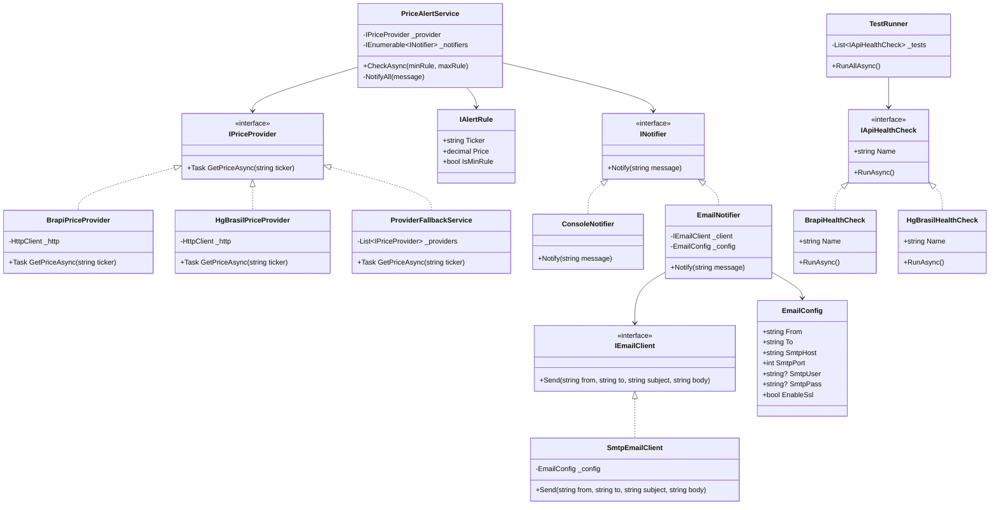

# Monitor de Ações

Monitor de Ações é uma aplicação de console .NET que acompanha os preços de ações brasileiras e dispara alertas quando atingem limites mínimos ou máximos definidos pelo usuário. O sistema utiliza múltiplas APIs de mercado para garantir alta disponibilidade, com fallback automático entre os provedores de dados.

## Funcionalidades

*   **Busca de Preços em Tempo Real**: Recupera os preços atuais das ações usando APIs externas.
*   **Sistema de Fallback de API**: Integra-se com as APIs Brapi e HgBrasil. Se um provedor falhar, automaticamente recorre ao próximo, garantindo a disponibilidade dos dados.
*   **Alertas de Preço Personalizáveis**: Defina limites mínimos e máximos de preço para qualquer ticker de ação.
*   **Notificações no Console**: Receba alertas imediatos no console quando um limite de preço for ultrapassado.
*   **Notificações por Email**: Receba alertas imediatos por email quando um limite de preço for ultrapassado.
*   **Verificações de Integridade da API**: Inclui um utilitário de teste para verificar o status e a resposta das APIs integradas.
## Desenvolvimento
Usei a base do SOLID para escrever um código que seja estável e consiga ser modificado no futuro de forma mais fácil  

| Princípio                     | Como o código segue                                                                                                                                                          |
| ----------------------------- | ---------------------------------------------------------------------------------------------------------------------------------------------------------------------------- |
| **S** - Single Responsibility | Cada classe tem uma única responsabilidade: `PriceAlertService` verifica preços, `EmailNotifier` envia emails, `BrapiPriceProvider` busca preços da API Brapi, etc.          |
| **O** - Open/Closed           | As classes são abertas para extensão, mas fechadas para modificação. Por exemplo, é fácil adicionar outro `IPriceProvider` ou `INotifier` sem alterar as classes existentes. |
| **L** - Liskov Substitution   | Interfaces (`IPriceProvider`, `INotifier`, `IApiHealthCheck`) permitem substituir implementações concretas sem quebrar o código.                                             |
| **I** - Interface Segregation | As interfaces são pequenas e específicas: `IPriceProvider` só tem `GetPriceAsync`, `INotifier` só tem `Notify`, evitando métodos desnecessários.                             |
| **D** - Dependency Inversion  | As classes dependem de abstrações (`IPriceProvider`, `INotifier`) em vez de implementações concretas. O `Program.cs` injeta dependências via DI container.                   |

## Começando

Siga estas instruções para obter uma cópia do projeto e executá-lo em sua máquina local.

### Pré-requisitos

*   [.NET 10.0 SDK](https://dotnet.microsoft.com/download/dotnet/10.0) ou superior.
*   Uma chave de API do [HG Brasil Finance](https://hgbrasil.com/status/finance). (Se você não tiver, o aplicativo funcionará normalmente, mas apenas com a API Brapi sem fallback)

### Configuração

1.  Clone o repositório para sua máquina local:
    ```sh
    git clone https://github.com/saboyaa/stock_monitoring_saboya.git
    cd stock_monitoring_saboya
    ```

2.  Crie um arquivo `.env` no diretório raiz copiando o arquivo de exemplo:
    ```sh
    cp .envexample .env
    ```

3.  Abra o arquivo `.env` e coloque suas chaves de API e configurações SMTP

### Uso

Execute a aplicação a partir do seu terminal, fornecendo o ticker da ação, o preço mínimo e o preço máximo como argumentos.  
obs: Os preços foram baseados no brasil então use a formatação de numeros brasileira. ex: 12.345,67  
**Formato do comando:**
```sh
dotnet run --project StockMonitor/StockMonitor.csproj <TICKER> <PREÇO_MÍNIMO> <PREÇO_MÁXIMO>
```

**Exemplo:**
Para monitorar PETR4 com um alerta de preço mínimo em R$38,00 e máximo em R$42,50:
```sh
dotnet run --project StockMonitor/StockMonitor.csproj PETR4 38,00 42,50
```

Se o preço atual de PETR4 estiver abaixo de R$38,00 ou acima de R$42,50, um alerta será exibido no console.

## Executando Testes

O projeto inclui um conjunto de verificações de integridade para garantir que as APIs externas (Brapi e HgBrasil) estejam operacionais. Para executar esses testes, use a flag `--test`.

```sh
dotnet run --project StockMonitor/StockMonitor.csproj --test
```

A saída mostrará o status de cada API e o preço buscado para o ticker de teste (PETR4).

```
Executando teste: BRAPI
✅ BRAPI: sucesso! Preço: 39.58
Executando teste: HgBrasil
✅ HgBrasil: sucesso! Preço: 39.58
```  
O projeto também inclui Testes Unitários para um melhor desenvolvimento.

```sh
dotnet test StockMonitor.Tests/StockMonitor.Tests.csproj
```

A saída mostrará o status de cada API e o preço buscado para o ticker de teste (PETR4).

```
...
Logs do teste 
... 
Resumo do teste: total: 6; falhou: 1; bem-sucedido: 5; ignorado: 0; duração: 4,7s
```

## Estrutura do Projeto

*   `Program.cs`: O ponto de entrada principal da aplicação. Ele analisa os argumentos da linha de comando e orquestra os serviços.
*   **`/Services`**: Contém a lógica para buscar os preços das ações.
    *   `IPriceProvider.cs`: Uma interface para todos os serviços provedores de preço.
    *   `BrapiPriceProvider.cs`: Implementação para obter preços da API Brapi.
    *   `HgBrasilPriceProvider.cs`: Implementação para obter preços da API HgBrasil.
    *   `ProviderFallbackService.cs`: Um serviço robusto que itera através dos provedores disponíveis (`Brapi`, `HgBrasil`) até que um retorne com sucesso um preço.
*   **`/Alerts`**: Gerencia as regras de alerta e a lógica de verificação.
    *   `IAlertRule.cs`: Uma interface para alertas.
    *   `PriceAlertService.cs`: Usa um provedor de preço para obter o preço atual e o verifica contra as regras de alerta definidas.
*   **`/Notifications`**: Gerencia os diferentes métodos de notificação de alertas.

    * `INotifier.cs`: Interface para notificadores (ex: console, email).
    * `ConsoleNotifier.cs`: Implementação que escreve alertas no console.
    * `EmailNotifier.cs`: Implementação que envia alertas via email usando um `IEmailClient`.
    * `IEmailClient.cs`: Interface que abstrai o envio de emails.
    * `SmtpEmailClient.cs`: Cliente SMTP real que envia emails usando `EmailConfig`.
    * `EmailConfig.cs`: Configurações de email (from, to, host, porta, SSL, credenciais).

*   **`/Tests`**: Contém verificações de integridade para serviços externos.  
    *   `IApiHealthCheck.cs`: Uma interface para implementações de verificação de integridade de API.
    *   `TestRunner.cs`: Um utilitário para executar todas as verificações de integridade registradas.
    *   `/ApiChecks`: Contém classes específicas de verificação de integridade para cada API integrada.
## Diagrama De Classe

## Possíveis melhorias futuras

* **APIs mais atualizadas**: Atualmente usamos Brapi e HgBrasil, que retornam preços do dia ou valores históricos. No futuro, podemos integrar APIs que forneçam **cotações em tempo real** ou com **menor latência**, garantindo alertas mais precisos.
* **Monitoramento contínuo aprimorado**: Adicionar agendamento configurável, logs históricos e alertas repetidos, permitindo acompanhar a evolução do preço ao longo do tempo.
* **Mais canais de notificação**: Além de e-mail e console, incluir **SMS, Telegram ou WhatsApp** para alertas mais imediatos.
* **Validação e segurança**: Tratar melhor entradas inválidas (preços negativos, tickers incorretos) e proteger credenciais de SMTP, usando **cofres de segredo** ou **variáveis de ambiente criptografadas**.
